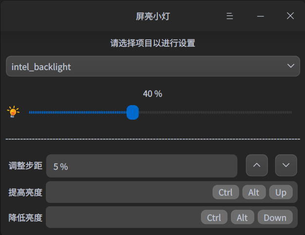

<h1 align="center"> WingSummer.ScreenLighter</h1>

屏亮小灯

## ScreenLighter

&emsp;&emsp;本软件是基于 QT 编写的十六进制编辑器，采用 C++ 进行开发。如果你在使用 Deepin 无法使用设置中心或者调控屏幕亮度的热键调控亮度，你可以尝试一下使用该程序是否能够解决问题。 **本程序可能会和系统设置的屏幕亮度会有冲突，除非你只想用该程序设置屏幕亮度。程序退出之后，亮度的设置应用仍旧有效。**

### 协议

&emsp;&emsp;本软件如果是开源版本将遵循`AGPL-3.0`协议，请勿用于该协议之外的用途。

## 效果图

屏亮小灯

